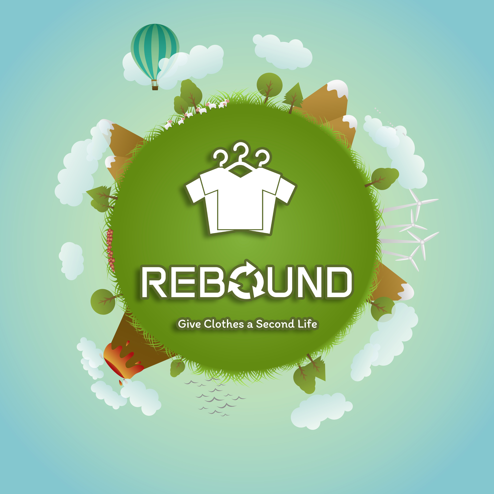
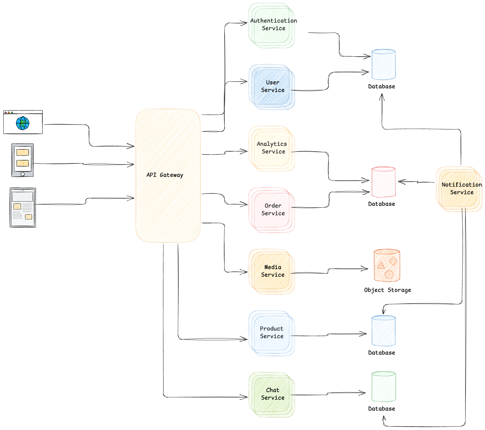
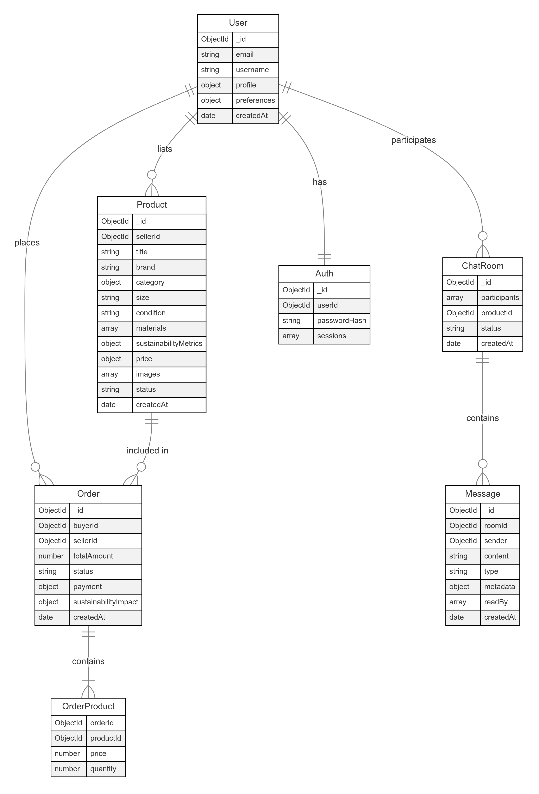

# Rebound: High Level Design

**Team**: Nehama  
**Members**: Omer Hadar, Dor Wachner  
**Lecturer:** Benny Rochwerger

# Table of Contents

1. [Introduction](#introduction)

   - Overview of Rebound and its mission
   - Goals and objectives of the platform

2. [Core Features](#core-features)

   - Clothes Upload System
   - Advanced Browsing and Filtering
   - Built-in Communication
   - Donation and Sale Options
   - User Profiles
   - Environmental Tracker (Future Feature)
   - Notification System (Future Feature)

3. [Main User Use Cases](#main-user-use-cases)

   - Buyer Use Case
   - Seller Use Case

4. [System Architecture Overview](#system-architecture-overview)

   - Microservices architecture
   - Scalability and Performance
   - Kubernetes for container orchestration

5. [Component Breakdown](#component-breakdown)

   - Core Services
   - Detailed Description of Individual Modules

6. [API Design](#api-design)

   - User Service
   - Authentication Service
   - Product Service
   - Order Service
   - Analytics Service
   - Media Service
   - Chat Service
   - Notification Service

7. [Data Model and Storage](#data-model-and-storage)

   - Non-SQL Database
   - Object Storage for Images
   - ER Diagram

8. [Integration Strategy](#integration-strategy)

   - Location-based Search
   - Benefits of OpenStreetMap (OSM) Integration
   - Planned Features with OSM

9. [User Interface Design](#user-interface-design)

   - Products Page
   - Detail Page
   - Chat Page
   - Profile Page
   - Map View

10. [Conclusion](#conclusion)

## Introduction

Rebound is an innovative social and environmental platform designed to promote sustainable fashion and community support. By enabling users to donate or sell clothes they no longer need, Rebound reduces clothing waste, extends the life of garments, and minimizes the environmental impact of the fashion industry. This project fosters a sense of social responsibility by supporting underprivileged communities and encouraging a culture of sharing and conscious consumption. Rebound empowers individuals to make a positive impact on both society and the planet, creating a more sustainable and equitable future through the simple act of reimagining our wardrobes.

## Core Features

1. **Clothes Upload System**

   - Users upload items with images, descriptions, size, and condition
   - A user-friendly interface makes the process quick and intuitive

2. **Advanced Browsing and Filtering**

   - Search and filter by size, clothing category, price, or condition (e.g., new, gently used)

3. **Built-in Communication**

   - Secure chat functionality allows users to communicate directly to finalize donations or sales

4. **Donation and Sale Options**

   - Users can choose to either donate clothes for free or sell them at an affordable price

5. **User Profiles**

   - Users can track uploaded items, monitor their activity, and manage chat conversations

6. **Environmental Tracker** (Future Feature)

   - A visual dashboard showing the positive environmental impact made by donating/reusing clothes

7. **Notification System** (Future Feature)
   - Real-time updates for new orders, order status changes, and new messages
   - Customizable notification preferences for users

## Main User Use Cases

### 1. Buyer Use Case

- **Browse Products**

  - Buyers can explore a catalog of items categorized by type, size, brand, and condition
  - Use the search bar with filters (e.g., location, price, category) for more precise results

- **Search by Location**

  - Use the map view to locate sellers nearby
  - Select a pin on the map to view the seller's items

- **View Product Details**

  - Check product descriptions, photos, seller ratings, and reviews

- **Contact Seller**

  - Use the built-in chat feature to ask questions about the product or negotiate prices

- **Make a Purchase**

  - Add products to the cart, confirm the order, and make a secure payment
  - Receive notification about the order status and track it (e.g., confirmed, shipped, delivered)

- **Leave Feedback**
  - Rate and review the seller after receiving the product

### 2. Seller Use Case

- **Create a Profile**

  - Sign up or log in to the application and update personal details, including location and preferences

- **List Items for Sale**

  - Upload images, provide a description, and set the price, size, and condition of the items

- **Manage Listings**

  - Update availability, edit product details, or delete items no longer for sale

- **Communicate with Buyers**

  - Receive notifications for new buyers or incoming messages
  - Respond to buyer inquiries and negotiate deals through the chat feature

- **Track Sales**
  - Manage incoming orders, update order statuses, and track delivery

## System Architecture Overview

Rebound will follow a microservices architecture with independent services for different functionalities. Each microservice will handle a specific aspect of the system, allowing for scalability, fault isolation, and easy maintainability. The platform will be deployed using Kubernetes to ensure high availability, load balancing, and container orchestration.

### Scalability and Performance

In our project, Kubernetes will serve as the foundation for managing and orchestrating containers, offering significant benefits in scalability and performance. These include:

1. **Automatic Scaling**: Dynamically adjusts resources based on real-time demand, ensuring consistent performance during peak and off-peak times

2. **Efficient Resource Utilization**: Optimizes the allocation of compute, storage, and network resources, minimizing waste and maximizing efficiency

3. **High Availability and Fault Tolerance**: Ensures uninterrupted service delivery through self-healing, load balancing, and redundant systems

4. **Enhanced Performance**: Leverages distributed resources to reduce bottlenecks and latency, improving system responsiveness and throughput

5. **Simplified Maintenance and Updates**: Enables rolling updates and rollbacks with minimal downtime, ensuring seamless deployment and management of applications

6. **Cost Optimization**: Reduces infrastructure costs by efficiently allocating resources, scaling down unused workloads, and maximizing hardware utilization

7. **Improved Security**: Provides robust isolation between workloads and supports security best practices such as secrets management, network policies, and runtime protection

By leveraging Kubernetes, we can achieve a highly scalable, reliable, and efficient platform that meets the demands of modern application workloads while maintaining cost-effectiveness and security.

## Component Breakdown

### Core Services:

### Detailed description of individual modules

1. **User Service**

   - Profile management including:
     - Personal information (name, email, address, preferences)
     - Size preferences and measurements
     - Reputation/rating system for buyers and sellers
   - Integration with Authentication Service for user data security

2. **Authentication Service**

   - User registration and login flows
   - JWT token generation and validation
   - Password reset functionality
   - Role-based access control (admin, regular user)

3. **Product Service**

   - Clothing item management:
     - Detailed item descriptions (brand, size, condition, materials)
     - Pricing information
     - Item categories and tags
     - Item availability status
   - Search functionality:
     - Filter by size, brand, condition, price
     - Category-based browsing
     - Advanced search with multiple criteria
   - Recommendation engine based on user preferences

4. **Order Service**

   - Order processing
   - Order tracking:
     - Status updates
     - Delivery confirmation
   - Transaction history

5. **Analytics Service**

   - Environmental impact tracking:
     - Carbon footprint savings per transaction
     - Total water saved through second-hand purchases
     - Material recycling metrics

6. **Media Service**

   - Image management:
     - Upload and storage of product photos
     - Image optimization and resizing
     - Thumbnail generation

7. **Chat Service**

   - Real-time messaging between users:
     - Direct messaging
     - Item-specific inquiries
     - Negotiation support
   - Features:
     - Message history
     - Read receipts
     - Typing indicators
     - Push notifications
   - Integration with Media Service for sharing images
   - Message moderation and reporting system

8. **Notification Service**
   - Real-time notifications for:
     - New orders
     - Order status updates
     - New messages in chat
   - Notification delivery methods:
     - In-app alerts
     - Email / Telegram notifications
   - User settings:
     - Customizable preferences for which notifications to receive

### Key Considerations for All Services:

1. Scalability: Each service should be designed to handle growing user base
2. Security: Implement proper encryption and data protection
3. Monitoring: Error tracking and performance monitoring
4. Documentation: API documentation and service specifications
5. Testing: Unit tests, integration tests, and end-to-end testing
6. Logging: Comprehensive logging for debugging and monitoring
7. Containerization: Docker containers for consistent deployment
8. API Gateway: Central point for routing requests to appropriate services

## API Design

Below is a detailed API design for each module:

### 1. User Service

**Endpoints:**

- **GET /users/{userId}**

  - Retrieve user profile details
  - Parameters: userId
  - Response: `{ "name": "John Doe", "email": "john@example.com", ... }`

- **PUT /users/{userId}**

  - Update user profile information
  - Body: `{ "name": "John Doe", "address": "123 Street", "preferences": {...} }`

- **POST /users/{userId}/reputation**
  - Update user reputation
  - Body: `{ "rating": 4.5, "feedback": "Great seller!" }`

### 2. Authentication Service

**Endpoints:**

- **POST /auth/register**

  - User registration
  - Body: `{ "email": "john@example.com", "password": "123456", ... }`

- **POST /auth/login**

  - User login
  - Body: `{ "email": "john@example.com", "password": "123456" }`
  - Response: `{ "token": "JWT_TOKEN" }`

- **POST /auth/reset-password**

  - Request password reset

- **POST /auth/validate-token**

  - Validate JWT token

- **GET /auth/roles/{userId}**
  - Get user roles

### 3. Product Service

Manages product-related operations.

**Endpoints:**

- **GET /products/{productId}**

  - Retrieve product details

- **POST /products**

  - Add a new product
  - Body: `{ "name": "Jacket", "brand": "BrandX", "size": "M", ... }`

- **PUT /products/{productId}**

  - Update product details

- **GET /products**

  - Search for products with filters
  - Query Parameters: size, brand, price, category, etc.

- **GET /products/recommendations/{userId}**
  - Get recommended products for a user

### 4. Order Service

Handles order processing and tracking.

**Endpoints:**

- **POST /orders**

  - Place a new order
  - Body: `{ "userId": "123", "productId": "456", ... }`

- **GET /orders/{orderId}**

  - Retrieve order details and status

- **GET /orders/user/{userId}**

  - Retrieve all orders for a user

- **POST /orders/{orderId}/status**
  - Update order status

### 5. Analytics Service

Provides environmental impact metrics.

**Endpoints:**

- **GET /analytics/user/{userId}**

  - Retrieve user's environmental impact metrics
  - Response: `{ "carbonFootprintSaved": "5kg", "waterSaved": "50L", ... }`

- **GET /analytics/global**
  - Retrieve platform-wide impact metrics

### 6. Media Service

Handles image management and processing.

**Endpoints:**

- **POST /media/upload**

  - Upload an image
  - Body: Image file

- **GET /media/{imageId}**

  - Retrieve an image by ID

- **DELETE /media/{imageId}**

  - Delete an image

- **GET /media/{imageId}/thumbnail**
  - Retrieve a thumbnail for an image

### 7. Chat Service

Manages real-time messaging between users.

**Endpoints:**

- **POST /chat/send**

  - Send a message
  - Body: `{ "fromUserId": "123", "toUserId": "456", "message": "Hello!" }`

- **GET /chat/conversation/{conversationId}**

  - Retrieve message history for a conversation

- **POST /chat/report**

  - Report a message
  - Body: `{ "messageId": "789", "reason": "Spam" }`

- **POST /chat/typing**

  - Update typing indicator status

- **GET /chat/notifications/{userId}**
  - Retrieve chat notifications

### 8. Notification Service

The Notification Service is a background process that continuously checks the database for new events, such as:

- New orders or order status updates
- Incoming messages

Since this is a background process, it does not have direct API endpoints but operates through database polling and event detection.

## Data Model and Storage

To manage and store data efficiently, our approach includes:

1. **Non-SQL Database**:

   - A NoSQL database will be utilized to store all information related to users, products, and orders
   - This allows for flexibility, scalability, and efficient handling of diverse and dynamic data structures

2. **Object Storage for Images**:
   - All image assets will be stored using object storage solutions, ensuring scalability and easy retrieval
   - Object storage is well-suited for handling unstructured data like images, providing high availability and durability

This architecture supports high performance, scalability, and reliability for our data and media management needs.

### ER Diagram:

## Integration Strategy

One of the key features of our application is the **location-based search** functionality, which allows users to search for products by the seller's address. To enhance this feature, the application will integrate with **OpenStreetMap (OSM)** to provide an intuitive and visually appealing map view.

### Benefits of OSM Integration:

- **Dynamic Map Display**: Users can view seller locations directly on an interactive map, making it easier to browse and discover nearby listings

- **Enhanced User Experience**: The integration will offer features like zooming, panning, and clustering of nearby items for seamless navigation

- **Customizable Map Styles**: OpenStreetMap's flexible styling options will allow us to design a map that aligns with the application's branding

- **Low Cost and Open Data**: By leveraging OSM's open data, we ensure cost-effective implementation while benefiting from high-quality geographical information

### Planned Features:

1. **Search by Location**:

   - Users can search for sellers or items by entering a city, region, or address
   - The results will be displayed as pins on the map with detailed information available on click

2. **Filter by Distance**:
   - Include options to filter search results based on proximity to the user or a specified location

By integrating with OpenStreetMap, we aim to deliver a feature-rich, location-aware experience that improves usability and engagement for our users.

## User Interface Design:

- The mock-ups serve as a visual concept of the website's design, but the final version may evolve and differ based on feedback and development needs.

### Products Page:

### Detail Page:

### Chat Page:

### Profile Page:

### Map View:

## Conclusion

Rebound represents a forward-thinking approach to sustainable fashion, offering a platform that not only reduces clothing waste but also fosters a sense of community and social responsibility. By enabling users to donate, sell, and recycle clothes, we are creating a more conscious and equitable fashion ecosystem. With its seamless user experience, location-based features, and integration with environmental tracking, Rebound has the potential to drive significant change in how we view and engage with our wardrobes. Moving forward, we aim to continuously innovate and expand the platform, adding more features and growing its impact on both society and the environment. Rebound is not just about fashion, it’s about reshaping the way we think, consume, and contribute to a sustainable future.
